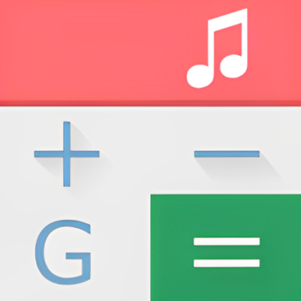
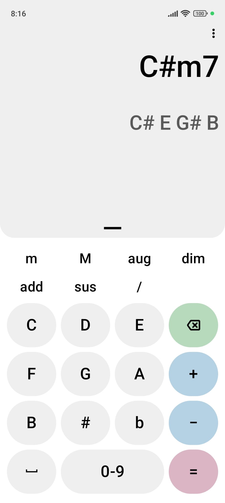
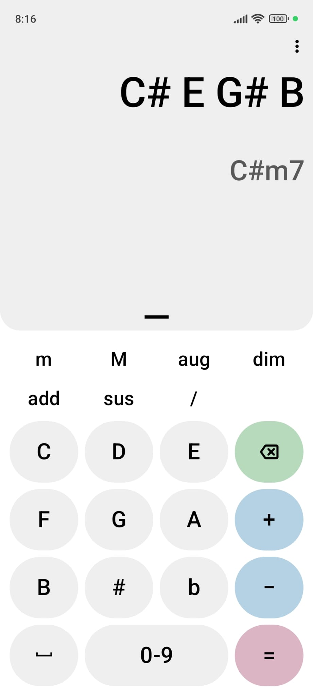
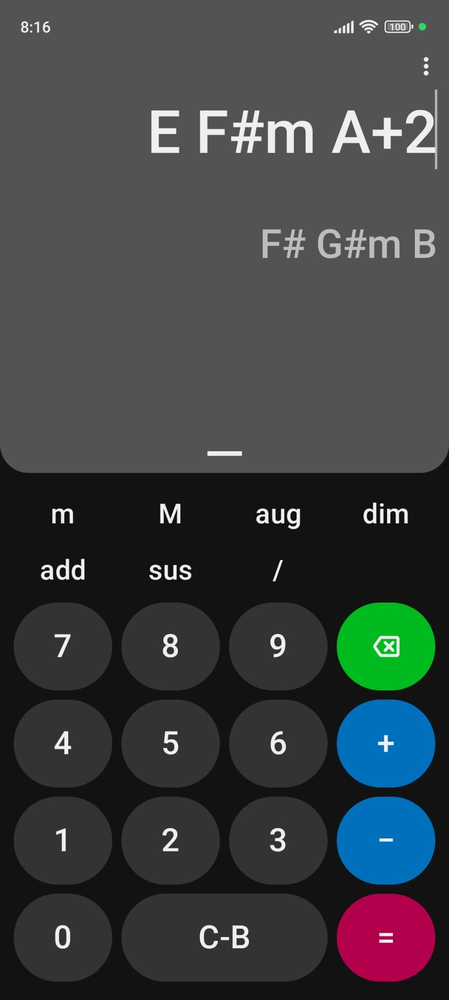
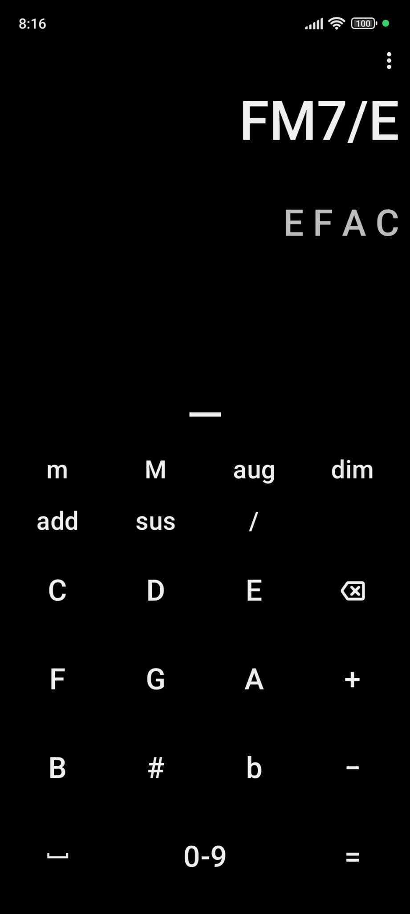

# Chord Calculator

### Decode chords and transpose them easily!

 

## 📖 Features

* Lightweight (APK ~2MB)
* No unnecessary permissions
* Dark, Light, Amoled and Material You theme
* History
* Portrait and landscape orientation
* Quick Settings Tile
* More...

## ⚠️ Requirements

* Android 7.0+

## 📷 Screenshots

## 📜 License

This project is licensed under [GPLv3](/LICENSE)

# Repository View Counter

